# Cloud Firestore Android Codelab

[Codelab Feedback](https://github.com/firebase/friendlyeats-android/issues)


## Overview
Duration: 01:00


### Goals

In this codelab you will build a restaurant recommendation app on Android backed by Cloud Firestore. You will learn how to:

* Read and write data to Firestore from an Android app
* Listen to changes in Firestore data in realtime
* Use Firebase Authentication and security rules to secure Firestore data
* Write complex Firestore queries

### Prerequisites

Before starting this codelab make sure you have:

* Android Studio **4.0** or higher
* An Android emulator with API **19** or higher
* Node.js version **10** or higher
* Java version **8** or higher


## Create a Firebase project

1. Sign into the  [Firebase console](https://firebase.google.com/) with your Google account.
2. In the  [Firebase console](https://console.firebase.google.com), click **Add project**.
3. As shown in the screen capture below, enter a name for your Firebase project (for example, "Friendly Eats"), and click **Continue**.

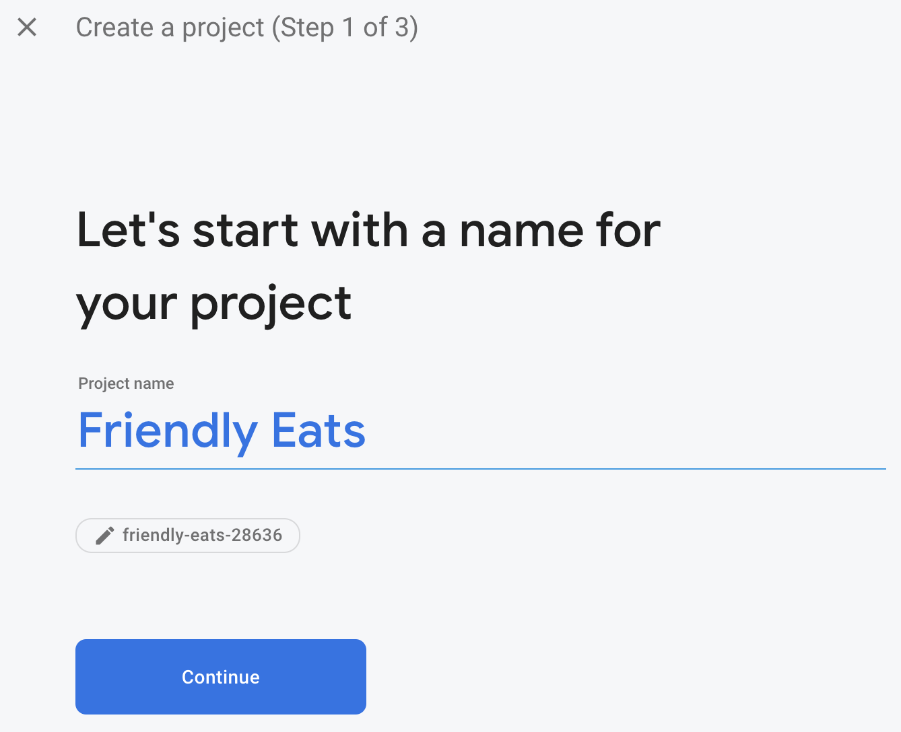

4. You may be asked to enable Google Analytics, for the purposes of this codelab your selection does not matter.
5. After a minute or so, your Firebase project will be ready. Click **Continue**.

## Set up the sample project
Duration: 05:00

### Download the code

Run the following command to clone the sample code for this codelab.  This will create a folder called `friendlyeats-android` on your machine:

```console
$ git clone https://github.com/firebase/friendlyeats-android
```

If you don't have git on your machine, you can also download the code directly from GitHub.

### Add Firebase configuration

1. In the  [Firebase console](https://console.firebase.google.com), select **Project Overview** in the left nav. Click the **Android** button to select the platform.  When prompted for a package name use `com.google.firebase.example.fireeats`

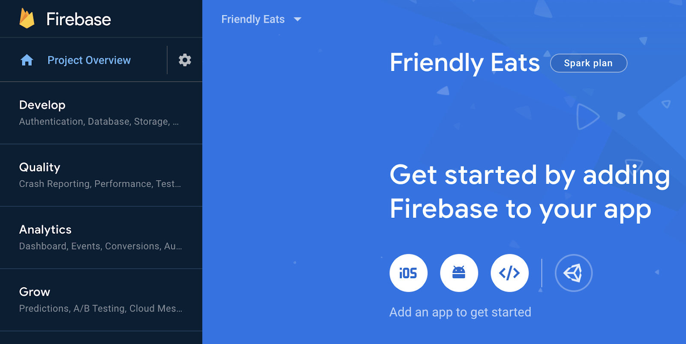

2. Click **Register App** and follow the instructions to download the `google-services.json` file, and move it into the `app/` folder of the code you just downloaded. Then click **Next**.

### Import the project

Open Android Studio. Click **File** > **New** > **Import Project** and select the **friendlyeats-android** folder.

## Set up the Firebase Emulators
Duration: 05:00

In this codelab you'll use the [Firebase Emulator Suite](https://firebase.google.com/docs/emulator-suite) to locally emulate Cloud Firestore and other Firebase services. This provides a safe, fast, and no-cost local development environment to build your app.

### Install the Firebase CLI

First you will need to install the [Firebase CLI](https://firebase.google.com/docs/cli). If you are using macOS or Linux, you can run the following cURL command:

```console
curl -sL https://firebase.tools | bash
```

If you are using Windows, read the [installation instructions](https://firebase.google.com/docs/cli#install-cli-windows) to get a standalone binary or to install via `npm`.

Once you've installed the CLI, running `firebase --version` should report a version of `9.0.0` or higher:

```console
$ firebase --version
9.0.0
```

### Log In

Run `firebase login` to connect the CLI to your Google account. This will open a new browser window to complete the login process. Make sure to choose the same account you used when creating your Firebase project earlier.

### Link your project

From within the `friendlyeats-android` folder run `firebase use --add` to connect your local project to your Firebase project. Follow the prompts to select the project you created earlier and if asked to choose an alias enter `default`.

## Run the app
Duration: 02:00

Now it's time to run the Firebase Emulator Suite and the FriendlyEats Android app for the first time.

### Run the emulators

In your terminal from within the `friendlyeats-android` directory run `firebase emulators:start` to start up the Firebase Emulators. You should see logs like this:

```console
$ firebase emulators:start
i  emulators: Starting emulators: auth, firestore
i  firestore: Firestore Emulator logging to firestore-debug.log
i  ui: Emulator UI logging to ui-debug.log

┌─────────────────────────────────────────────────────────────┐
│ ✔  All emulators ready! It is now safe to connect your app. │
│ i  View Emulator UI at http://localhost:4000                │
└─────────────────────────────────────────────────────────────┘

┌────────────────┬────────────────┬─────────────────────────────────┐
│ Emulator       │ Host:Port      │ View in Emulator UI             │
├────────────────┼────────────────┼─────────────────────────────────┤
│ Authentication │ localhost:9099 │ http://localhost:4000/auth      │
├────────────────┼────────────────┼─────────────────────────────────┤
│ Firestore      │ localhost:8080 │ http://localhost:4000/firestore │
└────────────────┴────────────────┴─────────────────────────────────┘
  Emulator Hub running at localhost:4400
  Other reserved ports: 4500

Issues? Report them at https://github.com/firebase/firebase-tools/issues and attach the *-debug.log files.
```

You now have a complete local development environment running on your machine! Make sure to leave this command running for the rest of the codelab, your Android app will need to connect to the emulators.

### Connect app to the Emulators

Open the files `util/FirestoreInitializer.kt` and `util/AuthInitializer.kt` in Android Studio.
These files contain the logic to connect the Firebase SDKs to the local emulators running on your machine, upon application startup.

On the `create()` method of the `FirestoreInitializer` class, examine this piece of code:

```kotlin
    // Use emulators only in debug builds
    if (BuildConfig.DEBUG) {
        firestore.useEmulator(FIRESTORE_EMULATOR_HOST, FIRESTORE_EMULATOR_PORT)
    }
```

We are using `BuildConfig` to make sure we only connect to the emulators when our app is running in `debug` mode. When we compile the app in `release` mode this condition will be false.

We can see that it is using the `useEmulator(host, port)` method to connect the Firebase SDK to the local Firestore emulator. Throughout the app we will use `FirebaseUtil.getFirestore()` to access this instance of `FirebaseFirestore` so we are sure that we're always connecting to the Firestore emulator when running in `debug` mode.

### Run the app

If you have added the `google-services.json` file properly, the project should now compile. In Android Studio click **Build** &gt; **Rebuild Project** and ensure that there are no remaining errors.

In Android Studio **Run** the app on your Android emulator.  At first you will be presented with a "Sign in" screen.  You can use any email and password to sign into the app. This sign in process is connecting to the Firebase Authentication emulator, so no real credentials are being transmitted.

> aside negative
>
> Note: In order for your app to communicate with the Firebase Emulator Suite, it must be running on an Android Emulator, not a real Android device. This will allow the app to communicate with the Firebase Emulator Suite on `localhost`.

Now open the Emulators UI by navigating to [http://localhost:4000](http://localhost:4000) in your web browser. Then click on the **Authentication** tab and you should see the account you just created:

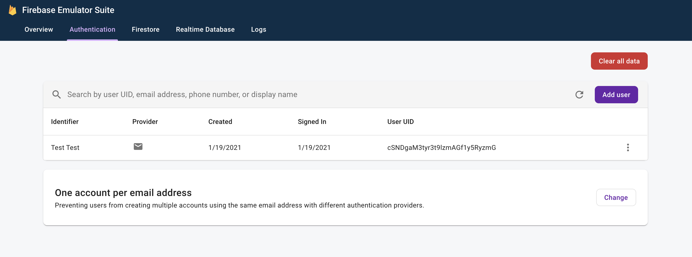

Once you have completed the sign in process you should see the app home screen:

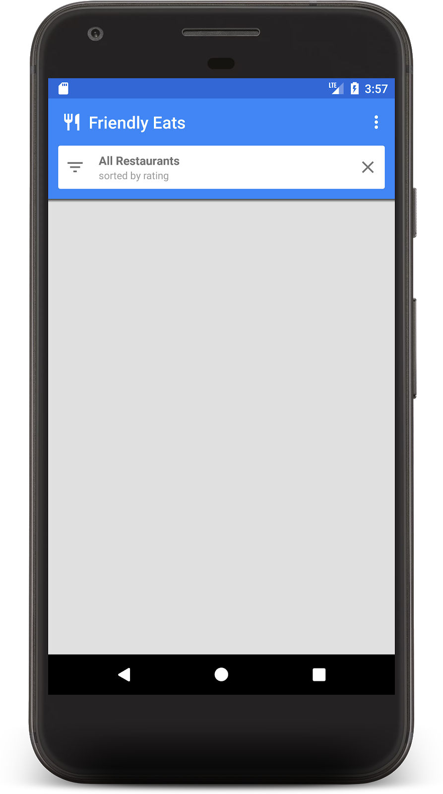

Soon we will add some data to populate the home screen.


## Write data to Firestore
Duration: 05:00


In this section we will write some data to Firestore so that we can populate the currently empty home screen.

The main model object in our app is a restaurant (see `model/Restaurant.kt`).  Firestore data is split into documents, collections, and subcollections.  We will store each restaurant as a document in a top-level collection called `"restaurants"`.  To learn more about the Firestore data model, read about documents and collections in [the documentation](https://firebase.google.com/docs/firestore/data-model).

For demonstration purposes, we will add functionality in the app to create ten random restaurants when we click the "Add Random Items" button in the overflow menu.  Open the file `MainFragment.kt` and replace the content in the `onAddItemsClicked()` method with:

```kotlin
    private fun onAddItemsClicked() {
        val restaurantsRef = firestore.collection("restaurants")
        for (i in 0..9) {
            // Create random restaurant / ratings
            val randomRestaurant = RestaurantUtil.getRandom(requireContext())

            // Add restaurant
            restaurantsRef.add(randomRestaurant)
        }
    }
```

There are a few important things to note about the code above:

* We started by getting a reference to the `"restaurants"` collection. Collections are created implicitly when documents are added, so there was no need to create the collection before writing data.
* Documents can be created using Kotlin data classes, which we use to create each Restaurant doc.
* The `add()` method adds a document to a collection with an auto-generated ID, so we did not need to specify a unique ID for each Restaurant.

Now run the app again and click the "Add Random Items" button in the overflow menu (at the top right corner) to invoke the code you just wrote:

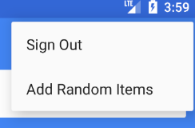

Now open the Emulators UI by navigating to [http://localhost:4000](http://localhost:4000) in your web browser. Then click on the **Firestore** tab and you should see the data you just added:

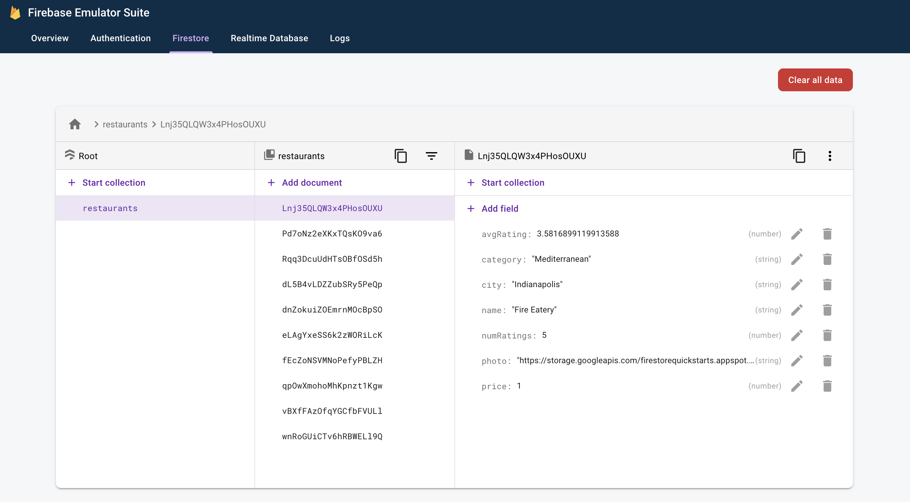

This data is 100% local to your machine. In fact, your real project doesn't even contain a Firestore database yet! This means it's safe to experiment with modifying and deleting this data without consequence.

Congratulations, you just wrote data to Firestore! In the next step we'll learn how to display this data in the app.


## Display data from Firestore
Duration: 10:00


In this step we will learn how to retrieve data from Firestore and display it in our app. The first step to reading data from Firestore is to create a `Query`. Open the file `MainFragment.kt` and add the following code to the beginning of the `onViewCreated()` method:

```kotlin
        // Firestore
        firestore = Firebase.firestore

        // Get the 50 highest rated restaurants
        query = firestore.collection("restaurants")
            .orderBy("avgRating", Query.Direction.DESCENDING)
            .limit(LIMIT.toLong())
```

Now we want to listen to the query, so that we get all matching documents and are notified of future updates in real time.  Because our eventual goal is to bind this data to a `RecyclerView`, we need to create a `RecyclerView.Adapter` class to listen to the data.

Open the `FirestoreAdapter` class, which has been partially implemented already.  First, let's make the adapter implement `EventListener` and define the `onEvent` function so that it can receive updates to a Firestore query:

```kotlin
abstract class FirestoreAdapter<VH : RecyclerView.ViewHolder>(private var query: Query?) :
        RecyclerView.Adapter<VH>(),
        EventListener<QuerySnapshot> { // Add this implements
    
    // ...

    // Add this method
    override fun onEvent(documentSnapshots: QuerySnapshot?, e: FirebaseFirestoreException?) {
        
        // Handle errors
        if (e != null) {
            Log.w(TAG, "onEvent:error", e)
            return
        }

        // Dispatch the event
        if (documentSnapshots != null) {
            for (change in documentSnapshots.documentChanges) {
                // snapshot of the changed document
                when (change.type) {
                    DocumentChange.Type.ADDED -> {
                        // TODO: handle document added
                    }
                    DocumentChange.Type.MODIFIED -> {
                        // TODO: handle document changed
                    }
                    DocumentChange.Type.REMOVED -> {
                        // TODO: handle document removed
                    }
                }
            }
        }

        onDataChanged()
    }
    
    // ...
}
```

On initial load the listener will receive one `ADDED` event for each new document.  As the result set of the query changes over time the listener will receive more events containing the changes.  Now let's finish implementing the listener.  First add three new methods: `onDocumentAdded`, `onDocumentModified`, and `onDocumentRemoved`:

```kotlin
    private fun onDocumentAdded(change: DocumentChange) {
        snapshots.add(change.newIndex, change.document)
        notifyItemInserted(change.newIndex)
    }

    private fun onDocumentModified(change: DocumentChange) {
        if (change.oldIndex == change.newIndex) {
            // Item changed but remained in same position
            snapshots[change.oldIndex] = change.document
            notifyItemChanged(change.oldIndex)
        } else {
            // Item changed and changed position
            snapshots.removeAt(change.oldIndex)
            snapshots.add(change.newIndex, change.document)
            notifyItemMoved(change.oldIndex, change.newIndex)
        }
    }

    private fun onDocumentRemoved(change: DocumentChange) {
        snapshots.removeAt(change.oldIndex)
        notifyItemRemoved(change.oldIndex)
    }
```

Then call these new methods from `onEvent`:

```kotlin
    override fun onEvent(documentSnapshots: QuerySnapshot?, e: FirebaseFirestoreException?) {

        // Handle errors
        if (e != null) {
            Log.w(TAG, "onEvent:error", e)
            return
        }

        // Dispatch the event
        if (documentSnapshots != null) {
            for (change in documentSnapshots.documentChanges) {
                // snapshot of the changed document
                when (change.type) {
                    DocumentChange.Type.ADDED -> {
                        onDocumentAdded(change) // Add this line
                    }
                    DocumentChange.Type.MODIFIED -> {
                        onDocumentModified(change) // Add this line
                    }
                    DocumentChange.Type.REMOVED -> {
                        onDocumentRemoved(change) // Add this line
                    }
                }
            }
        }

        onDataChanged()
    }
```

Finally implement the `startListening()` method to attach the listener:

```kotlin
    fun startListening() {
        if (registration == null) {
            registration = query.addSnapshotListener(this)
        }
    }
```

> aside positive
>
> **Note**: this codelab demonstrates the real-time capabilities of Firestore, but it's also simple to fetch data without a listener.  You can call `get()` on any query or reference to fetch a data snapshot.

Now the app is fully configured to read data from Firestore.  **Run** the app again and you should see the restaurants you added in the previous step:

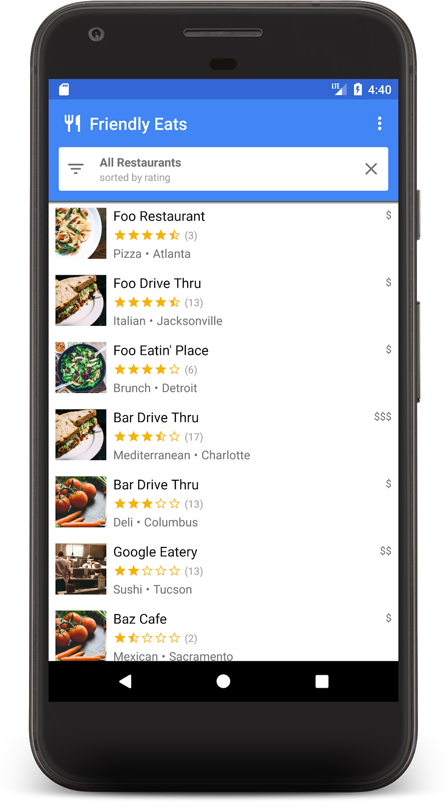

Now go back to the Emulator UI in your browser and edit one of the restaurant names.  You should see it change in the app almost instantly!


## Sort and filter data
Duration: 05:00


The app currently displays the top-rated restaurants across the entire collection, but in a real restaurant app the user would want to sort and filter the data.  For example the app should be able to show "Top seafood restaurants in Philadelphia" or "Least expensive pizza".

Clicking white bar at the top of the app brings up a filters dialog.  In this section we'll use Firestore queries to make this dialog work:

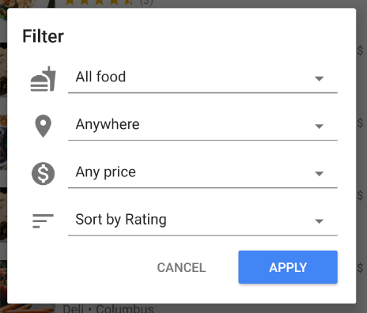

Let's edit the `onFilter()` method of `MainFragment.kt`.  This method accepts a `Filters` object which is a helper object we created to capture the output of the filters dialog.  We will change this method to construct a query from the filters:

```kotlin
    override fun onFilter(filters: Filters) {
        // Construct query basic query
        var query: Query = firestore.collection("restaurants")

        // Category (equality filter)
        if (filters.hasCategory()) {
            query = query.whereEqualTo(Restaurant.FIELD_CATEGORY, filters.category)
        }

        // City (equality filter)
        if (filters.hasCity()) {
            query = query.whereEqualTo(Restaurant.FIELD_CITY, filters.city)
        }

        // Price (equality filter)
        if (filters.hasPrice()) {
            query = query.whereEqualTo(Restaurant.FIELD_PRICE, filters.price)
        }

        // Sort by (orderBy with direction)
        if (filters.hasSortBy()) {
            query = query.orderBy(filters.sortBy.toString(), filters.sortDirection)
        }

        // Limit items
        query = query.limit(LIMIT.toLong())

        // Update the query
        adapter.setQuery(query)

        // Set header
        binding.textCurrentSearch.text = HtmlCompat.fromHtml(
            filters.getSearchDescription(requireContext()),
            HtmlCompat.FROM_HTML_MODE_LEGACY
        )
        binding.textCurrentSortBy.text = filters.getOrderDescription(requireContext())

        // Save filters
        viewModel.filters = filters
    }
```

In the snippet above we build a `Query` object by attaching `where` and `orderBy` clauses to match the given filters.

**Run** the app again and select the following filter to show the most popular low-price restaurants:

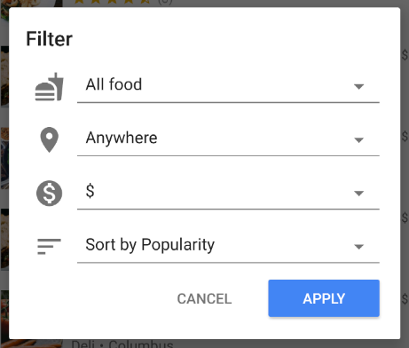

> aside negative
>
> A complex query like this one requires a **compound index**. When using the Firestore emulator all queries are allowed but if you tried to run this app with a real database you'd get the following warnings in the logs:
>
> ```console
> W/Firestore Adapter: onEvent:error
> com.google.firebase.firestore.FirebaseFirestoreException: FAILED_PRECONDITION: The query requires an index. You can create it here: https://console.firebase.google.com/project/firestore-codelab-android/database/firestore/indexes?create_index=EgtyZXN0YXVyYW50cxoJCgVwcmljZRACGg4KCm51bVJhdGluZ3MQAxoMCghfX25hbWVfXxAD
>     at com.google.android.gms.internal.ajs.zze(Unknown Source)
>    // ...
> ```
>
> There are two ways to add an index to your app:
>
>  1. Click the link in the error message to create it interactively.
>  1. Add the index to `firebase.indexes.json` and deploy it with the Firebase CLI.
>
> At the end of this codelab we will walk through this process.

You should now see a filtered list of restaurants containing only low-price options:

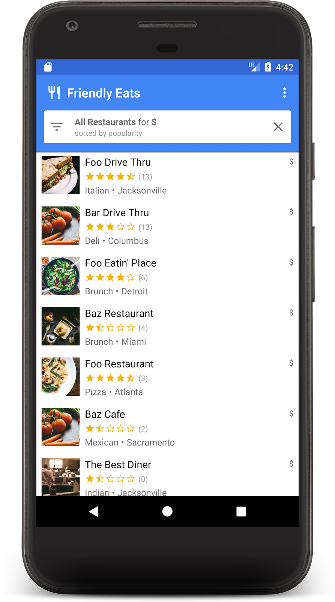


If you've made it this far, you have now built a fully functioning restaurant recommendation viewing app on Firestore!  You can now sort and filter restaurants in real time.  In the next few sections we'll add reviews to the restaurants and add security rules to the app.


## Organize data in subcollections
Duration: 05:00


In this section we'll add ratings to the app so users can review their favorite (or least favorite) restaurants.

### Collections and subcollections

So far we have stored all restaurant data in a top-level collection called "restaurants".  When a user rates a restaurant we want to add a new `Rating` object to the restaurants.  For this task we will use a subcollection.  You can think of a subcollection as a collection that is attached to a document.  So each restaurant document will have a ratings subcollection full of rating documents.  Subcollections help organize data without bloating our documents or requiring complex queries.

To access a subcollection, call `.collection()` on the parent document:

```kotlin
val subRef = firestore.collection("restaurants")
        .document("abc123")
        .collection("ratings")
```

You can access and query a subcollection just like with a top-level collection, there are no size limitations or performance changes.  You can read more about the Firestore data model  [here](https://firebase.google.com/docs/firestore/data-model).

### Writing data in a transaction

Adding a `Rating` to the proper subcollection only requires calling `.add()`, but we also need to update the `Restaurant` object's average rating and number of ratings to reflect the new data.  If we use separate operations to make these two changes there are a number of race conditions that could result in stale or incorrect data.

To ensure that ratings are added properly, we will use a transaction to add ratings to a restaurant.  This transaction will perform a few actions:

* Read the restaurant's current rating and calculate the new one
* Add the rating to the subcollection
* Update the restaurant's average rating and number of ratings

Open `RestaurantDetailFragment.kt` and implement the `addRating` function:

```kotlin
    private fun addRating(restaurantRef: DocumentReference, rating: Rating): Task<Void> {
        // Create reference for new rating, for use inside the transaction
        val ratingRef = restaurantRef.collection("ratings").document()

        // In a transaction, add the new rating and update the aggregate totals
        return firestore.runTransaction { transaction ->
            val restaurant = transaction.get(restaurantRef).toObject<Restaurant>()
                ?: throw Exception("Restaurant not found at ${restaurantRef.path}")

            // Compute new number of ratings
            val newNumRatings = restaurant.numRatings + 1

            // Compute new average rating
            val oldRatingTotal = restaurant.avgRating * restaurant.numRatings
            val newAvgRating = (oldRatingTotal + rating.rating) / newNumRatings

            // Set new restaurant info
            restaurant.numRatings = newNumRatings
            restaurant.avgRating = newAvgRating

            // Commit to Firestore
            transaction.set(restaurantRef, restaurant)
            transaction.set(ratingRef, rating)

            null
        }
    }
```

The `addRating()` function returns a `Task` representing the entire transaction.  In the `onRating()` function listeners are added to the task to respond to the result of the transaction.

Now **Run** the app again and click on one of the restaurants, which should bring up the restaurant detail screen.  Click the **+** button to start adding a review. Add a review by picking a number of stars and entering some text.

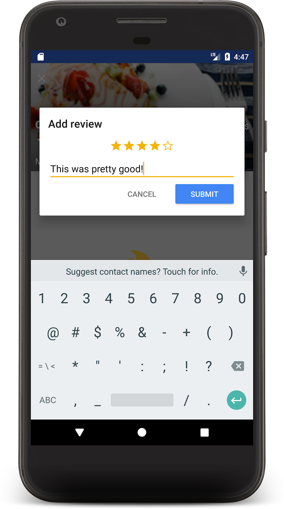

Hitting **Submit** will kick off the transaction. When the transaction completes, you will see your review displayed below and an update to the restaurant's review count:

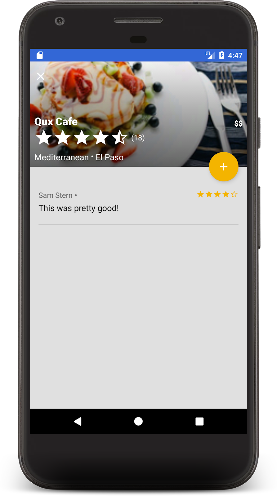

Congrats! You now have a social, local, mobile restaurant review app built on Cloud Firestore.  I hear those are very popular these days.


## Secure your data
Duration: 05:00

So far we have not considered the security of this application. How do we know that users can only read and write the correct own data? Firestore databases are secured by a configuration file called [Security Rules](https://firebase.google.com/docs/firestore/security/get-started).

Open the `firestore.rules` file, you should see the following:

```
rules_version = '2';
service cloud.firestore {
  match /databases/{database}/documents {
    match /{document=**} {
      //
      // WARNING: These rules are insecure! We will replace them with
      // more secure rules later in the codelab
      //
      allow read, write: if request.auth != null;
    }
  }
}
```

> aside negative
>
> **Warning**: the rules above are extremely insecure! Never deploy a real Firebase app without writing custom security rules.

Let's change these rules to prevent unwanted data acesss or changes, open the `firestore.rules` file and replace the content with the following:

```
rules_version = '2';
service cloud.firestore {
  match /databases/{database}/documents {
    // Determine if the value of the field "key" is the same
    // before and after the request.
    function isUnchanged(key) {
      return (key in resource.data)
        && (key in request.resource.data)
        && (resource.data[key] == request.resource.data[key]);
    }

    // Restaurants
    match /restaurants/{restaurantId} {
      // Any signed-in user can read
      allow read: if request.auth != null;

      // Any signed-in user can create
      // WARNING: this rule is for demo purposes only!
      allow create: if request.auth != null;

      // Updates are allowed if no fields are added and name is unchanged
      allow update: if request.auth != null
                    && (request.resource.data.keys() == resource.data.keys())
                    && isUnchanged("name");

      // Deletes are not allowed.
      // Note: this is the default, there is no need to explicitly state this.
      allow delete: if false;

      // Ratings
      match /ratings/{ratingId} {
        // Any signed-in user can read
        allow read: if request.auth != null;

        // Any signed-in user can create if their uid matches the document
        allow create: if request.auth != null
                      && request.resource.data.userId == request.auth.uid;

        // Deletes and updates are not allowed (default)
        allow update, delete: if false;
      }
    }
  }
}
```

These rules restrict access to ensure that clients only make safe changes.  For example updates to a restaurant document can only change the ratings, not the name or any other immutable data.  Ratings can only be created if the user ID matches the signed-in user, which prevents spoofing.

> aside positive
>
> When you save the `firestore.rules` file the Firestore emulator will automatically hot reload the new rules and apply them to future requests, there is no need to restart the emulators.

To read more about Security Rules, visit  [the documentation](https://firebase.google.com/docs/firestore/security/get-started).


## Conclusion
Duration: 01:00


You have now created a fully-featured app on top of Firestore.  You learned about the most important Firestore features including:

* Documents and collections
* Reading and writing data
* Sorting and filtering with queries
* Subcollections
* Transactions

### Learn More

To keep learning about Firestore, here are some good places to get started:

*  [Choose a data structure](https://firebase.google.com/docs/firestore/manage-data/structure-data)
*  [Simple and compound queries](https://firebase.google.com/docs/firestore/query-data/queries)

The restaurant app in this codelab was based on the "Friendly Eats" example application.  You can browse the source code for that app  [here](https://github.com/firebase/quickstart-android).

### Optional: Deploy to production

So far this app has only used the Firebase Emulator Suite. If you want to learn how to deploy this app to a real Firebase project, continue on to the next step.


## (Optional) Deploy your app
Duration: 05:00

So far this app has been entirely local, all of the data is contained in the Firebase Emulator Suite. In this section you will learn how to configure your Firebase project so that this app will work in production.

> aside positive
>
> All of the products used in this codelab are available on the [Spark plan](https://firebase.google.com/pricing/).

### Firebase Authentication

In the Firebase console go to the **Authentication** section and click **Get started**. Navigate to the **Sign-in method** tab and select the **Email/Password** option from **Native providers**.

Enable the **Email/Password** sign-in method and click **Save**.

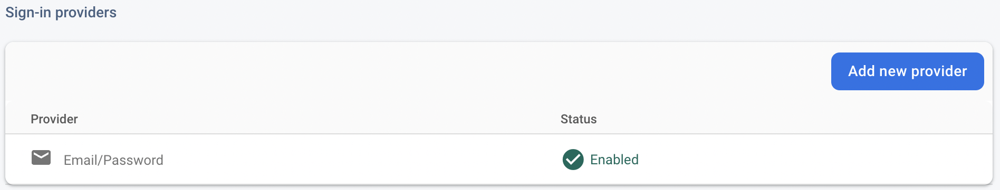


### Firestore

#### Create database

Navigate to the **Firestore Database** section of the console and click **Create Database**:

1. When prompted about Security Rules choose to start in **Production Mode**, we'll update those rules soon.
1. Choose the database location that you'd like to use for your app. Note that selecting a database location is a _permanent_ decision and to change it you will have to create a new project. For more information on choosing a project location, see the [documentation](https://firebase.google.com/docs/projects/locations).

#### Deploy Rules

To deploy the Security Rules you wrote earlier, run the following command in the codelab directory:

```console
$ firebase deploy --only firestore:rules
```

This will deploy the contents of `firestore.rules` to your project, which you can confirm by navigating to the **Rules** tab in the console.

#### Deploy Indexes

The FriendlyEats app has complex sorting and filtering which requires a number of custom compound indexes. These can be created by hand in the Firebase console but it is simpler to write their definitions in the `firestore.indexes.json` file and deploy them using the Firebase CLI.

If you open the `firestore.indexes.json` file you will see that the required indexes have already been provided:

```json
{
  "indexes": [
    {
      "collectionId": "restaurants",
      "queryScope": "COLLECTION",
      "fields": [
        { "fieldPath": "city", "mode": "ASCENDING" },
        { "fieldPath": "avgRating", "mode": "DESCENDING" }
      ]
    },
    {
      "collectionId": "restaurants",
      "queryScope": "COLLECTION",
      "fields": [
        { "fieldPath": "category", "mode": "ASCENDING" },
        { "fieldPath": "avgRating", "mode": "DESCENDING" }
      ]
    },
    {
      "collectionId": "restaurants",
      "queryScope": "COLLECTION",
      "fields": [
        { "fieldPath": "price", "mode": "ASCENDING" },
        { "fieldPath": "avgRating", "mode": "DESCENDING" }
      ]
    },
    {
      "collectionId": "restaurants",
      "queryScope": "COLLECTION",
      "fields": [
        { "fieldPath": "city", "mode": "ASCENDING" },
        { "fieldPath": "numRatings", "mode": "DESCENDING" }
      ]
    },
    {
      "collectionId": "restaurants",
      "queryScope": "COLLECTION",
      "fields": [
        { "fieldPath": "category", "mode": "ASCENDING" },
        { "fieldPath": "numRatings", "mode": "DESCENDING" }
      ]
    },
    {
      "collectionId": "restaurants",
      "queryScope": "COLLECTION",
      "fields": [
        { "fieldPath": "price", "mode": "ASCENDING" },
        { "fieldPath": "numRatings", "mode": "DESCENDING" }
      ]
    },
    {
      "collectionId": "restaurants",
      "queryScope": "COLLECTION",
      "fields": [
        { "fieldPath": "city", "mode": "ASCENDING" },
        { "fieldPath": "price", "mode": "ASCENDING" }
      ]
    },
    {
      "collectionId": "restaurants",
      "fields": [
        { "fieldPath": "category", "mode": "ASCENDING" },
        { "fieldPath": "price", "mode": "ASCENDING" }
      ]
    }
  ],
  "fieldOverrides": []
}
```

To deploy these indexes run the following command:

```console
$ firebase deploy --only firestore:indexes
```

Note that index creation is not instantaneous, you can monitor the progress in the Firebase console.

### Configure the app

In the `util/FirestoreInitializer.kt` and `util/AuthInitializer.kt` files we configured the Firebase SDK to connect to the emulators when in debug mode:

```kotlin
    override fun create(context: Context): FirebaseFirestore {
        val firestore = Firebase.firestore
        // Use emulators only in debug builds
        if (BuildConfig.DEBUG) {
            firestore.useEmulator(FIRESTORE_EMULATOR_HOST, FIRESTORE_EMULATOR_PORT)
        }
        return firestore
    }
```

If you would like to test your app with your real Firebase project you can either:

1. Build the app in release mode and run it on a device.
1. Temporarily replace `BuildConfig.DEBUG` with `false` and run the app again.

Note that you may need to **Sign Out** of the app and sign in again in order to properly connect to production.
